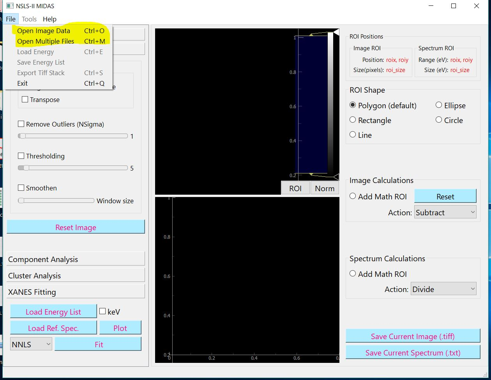
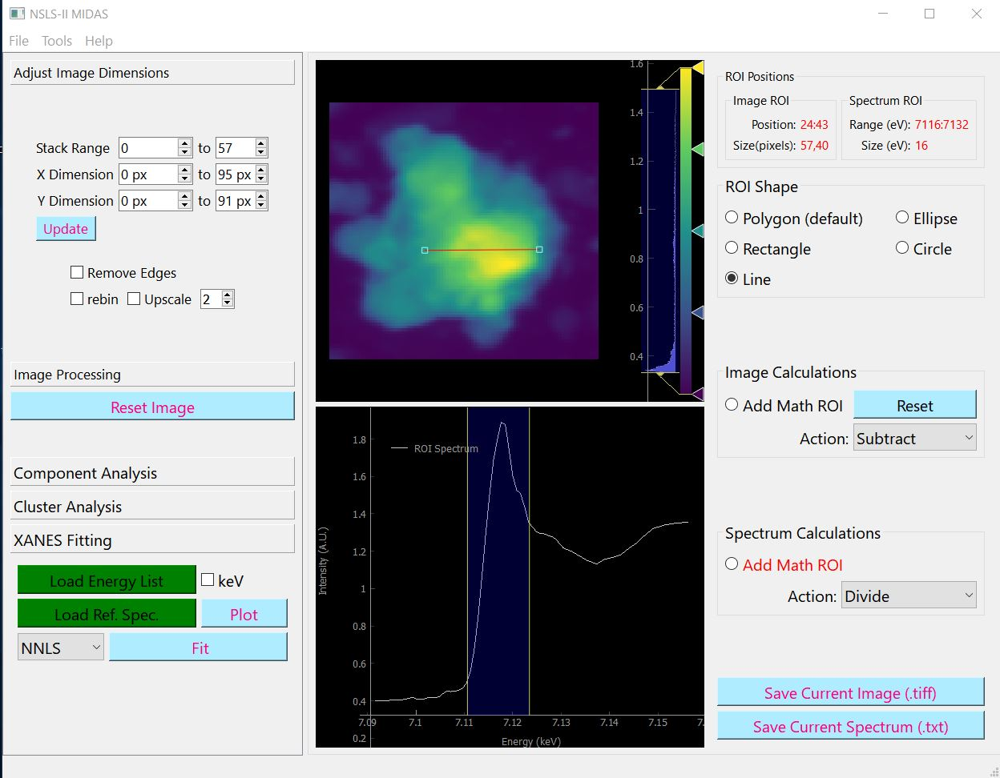

================
Nano-XANES Processing
================

In short
*****************
The aim is to generate multi-color chemical state maps from a XANES stack

What data are required?
--------

1. A 3D XANES stack or set of 2D tiff images
2. List of energy points (.txt files)
3. Reference spectrum library as simple colum files or .nor file from Athena (preferred)
Note : Make sure the athena file headers (spectrun names) are not too long. Parsing seems to fail otherwise but this problem will be addressed late.

2D-XANES Data
-------------

2D and 3D tiff images (stacks). The list of energies has to be loaded as a separate tiff file (see load energy section below)

To open the above data types use the "Open Image Data" option in the File menu and select the file.

Load Energy
-----------

You can load it using the following methods,

1. file menu option 'Load Energy'.

2. if you name the energy txt file matching the image file name, the program loads it automatically (like 'test.tiff' , 'test.txt').

3. In the folder you exported xanes data from the beamline there should be a log file named 'maps_log_tiff.txt'. Copy this to the same folder as the image file, then XMidas automatically load energy when you open the image.

Create an image stack
---------------------

You can also create a 3D image stack from a selection of single tiff files. To do so choose "Open Multiple Files"
options from the File menu.

Once loaded correctly you should see the image on the top panel and the spectrum on the bottom panel. In case of
incorrect formatting or unsupported formats, the bottom left corner of the program shows the error.

Also see the `Video Tutorial <https://www.youtube.com/watch?v=gGEN52nWLqk>`_
